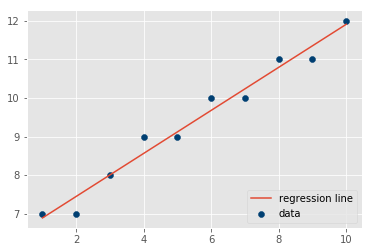
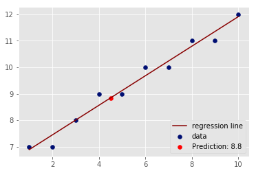

# Complete Regression - Lab

## Introduction
Now have all the necessary functions to calculate the slope, intercept, best-fit line, prediction and visualizations. In this lab you will put them all together to run a regression experiment and calculate model loss. 

## Objectives

You will be able to:

* Run a complete regression analysis through code only

## The formulas

Here are all the formulas to put everything in perspective

### Slope


### Intercept 


### R-squared


### Prediction


Use the functions created earlier to implement these formulas to run a regression analysis using X and Y as input variables. 


```python

# Combine all the functions created so far to run a complete regression experiment. 
# Produce an output similar to the one shown below. 

import numpy as np
import matplotlib.pyplot as plt
from matplotlib import style
style.use('ggplot')


def calc_slope(xs,ys):

    m = (((np.mean(xs)*np.mean(ys)) - np.mean(xs*ys)) /
         ((np.mean(xs)**2) - np.mean(xs*xs)))
    
    return m

def best_fit(xs,ys):

    m = calc_slope(xs,ys)
    b = np.mean(ys) - m*np.mean(xs)
    
    return m, b

def reg_line (m, b, X):
    
    return [(m*x)+b for x in X]

def sum_sq_err(ys_real,ys_predicted):

    sse =  sum((ys_predicted - ys_real) * (ys_predicted - ys_real))
    
    return sse

def r_squared(ys_real, ys_predicted):
    
    # Calculate Y_mean , squared error for regression and mean line , and calculate r-squared
    y_mean = [np.mean(ys_real) for y in ys_real]

    sq_err_reg= sum_sq_err(ys_real, ys_predicted)
    sq_err_y_mean = sum_sq_err(ys_real, y_mean)
    
    # Calculate r-squared 
    r_sq =  1 - (sq_err_reg/sq_err_y_mean)
    
    return r_sq

def plot_reg(X,Y,Y_pred):
    plt.scatter(X,Y,color='#003F72',label='data')
    plt.plot(X, Y_pred, label='regression line')
    plt.legend(loc=4)
    plt.show()
    return None

X = np.array([1,2,3,4,5,6,7,8,9,10], dtype=np.float64)
Y = np.array([7,7,8,9,9,10,10,11,11,12], dtype=np.float64)

m, b = best_fit(X,Y)
Y_pred = reg_line(m, b, X)
r_squared = r_squared(Y,Y_pred)

print ('Basic Regression Diagnostics')
print ('----------------------------')
print ('Slope:', round(m,2))
print ('Y-Intercept:', round(b,2))
print ('R-Squared:', round(r_squared,2))
print ('----------------------------')
print ('Model: Y =',round(m,2),'* X +', round(b,2))

plot_reg(X,Y,Y_pred)
       
# Basic Regression Diagnostics
# ----------------------------
# Slope: 0.56
# Y-Intercept: 6.33
# R-Squared: 0.97
# ----------------------------
# Model: Y = 0.56 * X + 6.33
```

    Basic Regression Diagnostics
    ----------------------------
    Slope: 0.56
    Y-Intercept: 6.33
    R-Squared: 0.97
    ----------------------------
    Model: Y = 0.56 * X + 6.33





## Make Predictions

Predict and plot the value of y using regression line above for a new value of x = 4.5.


```python
x_new = 4.5
y_new = (m*x_new)+b
y_new

plt.scatter(X,Y,color='#000F72',label='data')
plt.plot(X, Y_pred, color='#880000', label='regression line')
plt.scatter(x_new,y_new,color='r',label='Prediction: '+ str(np.round(y_new,1)))
plt.legend(loc=4)
plt.show()

```





## Level up - Optional 
Load the "heightWeight.csv" dataset. Use the height as an independant and weight as a dependant variable and draw a regression line to data using your code above. Calculate your R-square for the model and try to predict new values of Y. 

## Summary

In this lab, we ran a complete simple regression analysis experiment using functions created so far. Next We shall see how we can use python's built in modules to perform such analyses with a much higher level of sophistication. 
